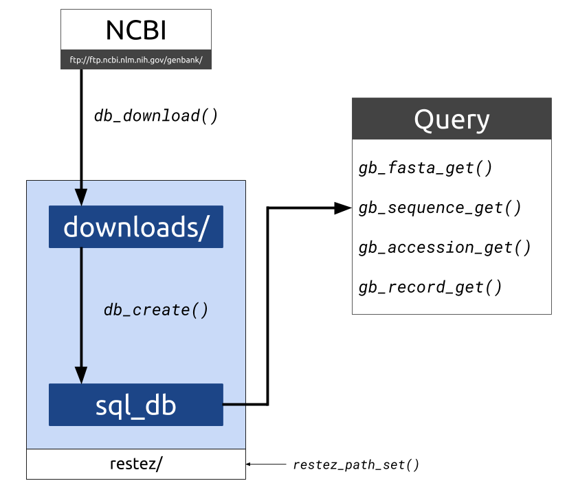

#Summary

Downloading sequences and sequence information from GenBank [@Benson2013] and related NCBI databases is often performed via the NCBI API, Entrez [@Ostell2002]. Entrez, however, has a limit on the number of requests, thus downloading large amounts of sequence data in this way can be inefficient. For situations where a large number of  Entrez calls are made, downloading may take days, weeks or even months and could even result in a user’s IP address being blacklisted from the NCBI services due to server overload.  Additionally, Entrez limits the number of entries that can be retrieved at once, requiring a user to develop code for querying in batches.

The `restez` package [@restez_z] aims to make sequence retrieval more efficient by allowing a user to download the GenBank database, either in its entirety or in subsets, to their local machine and query this local database instead. This process is more time efficient as GenBank downloads are made via NCBI’s FTP server using compressed sequence files. With a good internet connection and a middle-of-the-road computer, a database comprising 7 GB of sequence information (i.e. the total sequence data available for Rodentia as of 27 June 2018) can be generated in less than 10 minutes.


**Figure 1. The functions and file structure for downloading, setting up and querying a local copy of GenBank.`**

##Rentrez integration

`rentrez` [@Winter2017] is a popular R package for querying NCBI’s databases via Entrez in R. To maximize the compatibility of `restez`, we implemented wrapper functions with the same names and arguments as the `rentrez` equivalents. Whenever a wrapper function is called the local database copy is searched first. If IDs are missing in the local database a secondary call to Entrez is made via the internet. This allows for easy employment of `restez` in scripts and packages that are already using `rentrez`. At a minimum, a user currently using `rentrez` will only need to create a local, subset of the GenBank database and call `restez` instead of `rentrez`.

##A small example

After a restez database has been set-up, we can retrieve all the sequences from an `rentrez::entrez_search()` with a single command.

```{r}
# Use rentrez to search for accession IDs of interest
# Sequences in fasta format can then be retrieved with entrez_fetch
res <- rentrez::entrez_fetch(db = 'nuccore', id = ids, rettype = 'fasta') # likely to raise an error if too many IDs
res <- restez::entrez_fetch(db = 'nuccore', id = ids, rettype = 'fasta')
```

##A large example

`phylotaR` is an R package for  retrieving and identifying orthologous sequence clusters from GenBank as a first step in a phylogenetic analysis [@Bennett2018]. Because the package runs an automated pipeline, multiple queries to GenBank via Entrez are made using the `rentrez` package. As a result, for large taxonomic groups containing well-sequenced organisms the pipeline can take a long time to complete.

```{r}
library(phylotaR)
# run phylotaR pipeline for New World Monkeys
txid <- 9479  # taxonomic ID
setup(wd = 'nw_monkeys', txid = txid)
run(wd = wd)
# ^ takes around 40 minutes
```

We can download and create a local copy of the primates GenBank locally and re-run the above code with a library call to `restez` for speed-up gains and increased code reliability.

```{r}
# setup database
library(restez)
# Specify path to a local directory in which database will be stored
# Make sure you have sufficient disk space!
restez_path_set(filepath = 'restez_db')
db_download(db = 'nucleotide') # Interactively download GenBank data
db_create(db = 'nucleotide')
```
```{r}
# run phylotaR again
library(phylotaR)
library(restez)
txid <- 9479
setup(wd = 'nw_monkeys', txid = txid)
run(wd = wd)
# ^ takes around 5 minutes
```

**For more detailed and up-to-date examples and tutorials, see the `restez` GitHub page [@restez_gh].**

#Funding

This package has been developed as part of the supersmartR project [@supersmartR] which has received funding through A.A. (from the Swedish Research Council [B0569601], the Swedish Foundation for Strategic Research, a Wallenberg Academy Fellowship, the Faculty of Sciences at the University of Gothenburg, the Wenner-Gren Foundations, and the David Rockefeller Center for Latin American Studies at Harvard University) and through D.S. (from the Swedish Research Council [2015-04748]).

#References
